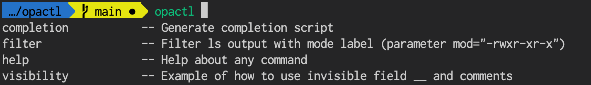
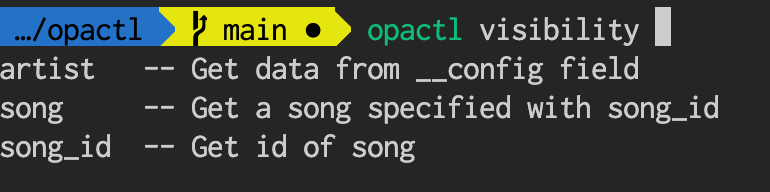

# opactl

`opactl` executes your own Rego (OPA) policy as CLI command. 

This is how it works. You define a rule in OPA policy, for example `rule1`. Then, `opactl` detects your rule and turns it into subcommand such as `opactl rule1`. It also supports completion with `tab` key.

Options are supported for various usage. Also, you can preset configuration file, then `opactl` reads it.

## Prerequisite

- CLI `opa` is used in `opactl`. You can install `opa` following [Running OPA](https://www.openpolicyagent.org/docs/latest/#running-opa).

## Execute a rule as subcommand

When you define a rule `filter` as follows, 

```rego
package opactl

# pick up only lines which includes specific mod
filter = { line |
  # load each line of stdin
  line := input.stdin[_]
  # split into words
  texts := split(texts, " ")
  # check the first word equals to parameter `mod`
  texts[0] == input.mod
}
```

you can run a subcommand `opactl filter` like this.

```sh
# Run subcommand filter with using stdin (-i) and parameter (mod=...)
ls -l | opactl -i filter -p mod="-rwxr-xr-x"
[
  "-rwxr-xr-x  1 hiroyukosaki  staff  8055840 May 12 01:04 opactl"
]
```

In another case, JSON can be read.

```sh
echo '{"orange": {"sweetness": "high"}, "cherry": {"sweetness":"middle"}}' | opactl -i json_filter
[
  "orange"
]
```

## Installation

Build from source

```sh
go build
sudo cp opactl /usr/local/bin/
```

### Enable shell completion

```sh
# bash
source <(opactl completion bash)
# zsh
opactl completion zsh > /usr/local/share/zsh/site-functions/_opactl
```

`opactl` autocompletes the subcommands.

```sh
opactl <tab>
hierarchy visibility ..(as many rules as you define)
```

## Options

```
Flags:
  -a, --all                 Show all commands
  -B, --base string         OPA base path which will be evaluated (default "data.opactl")
  -b, --bundle strings      bundles
      --config string       config file (default is <current directory>/.opactl)
  -d, --directory strings   directories
  -h, --help                help for opactl
  -i, --input               Accept stdin as input.stdin. Multiple lines are stored as array. JSON will be parsed and stored in input.json_stdin as well.
  -p, --parameter strings   parameter (key=value)
  -q, --query string        Input your own query script (example: { rtn | rtn := 1 }
  -v, --verbose             Toggle verbose mode on/off (display print() output)
```

Usage example)

```sh
opactl -a
# all rules should be listed.
[
  "filter",
  "hierarchy",
  "visibility"
]
```

## Configuration

You can create an `.opactl` configuration file. When you run `opactl` command in the same directory, `opactl` loads the configuration and set options. 

Each field in `.opactl` is connected to one option. For example, `parameter` field is read as `--parameter` option.

```
directory:
- examples
base: data.opactl
parameter:
- item=1
```

## Define your rule

- [Rules - Policy Language (Open Policy Agent)](https://www.openpolicyagent.org/docs/latest/policy-language/#rules)
  - Rules are virtual document in OPA. Rules allows users to generate objects, sets, arrays, functions and so on. 

```rego
# object
get_test_object = {
  "test": "test"
}

get_first_line = rtn {
  rtn := input.stdin[0]
} else = {}
# To define default return value is strongly recommended.

# set (Kind of list. Elements are unique. No order.)
select_unique_lines[rtn] {
  rtn := input.stdin[_]
}

# array (Kind of list. Elements are not necessary unique. The order is preserved.)
lines = [rtn|
  rtn := input.stdin[_]
]

```

## Advanced techniques

### 1. Shorthand of subcommand

If you have `cmd1` subcommand, you can create shorthand `c1` by adding the last one line.

```rego
package opactl

cmd1 = ...

c1 = cmd1
```

We can execute shorthand like this.

```sh
opactl c1 (= opactl cmd1)
```

### 2. Hierarchy of subcommand/subsubcommand and so on

- **Subcommand**

  You can create subcommand `opactl cmd1` by creating a rule `cmd1`.
- **Subsubcommand**

  when you need subsubcommand `opactl cmd2 cmd21` under the subcommand `opactl cmd2`, you can create a package `package opactl.cmd2` and create a rule `cmd21` under this package.
- **Subsubsubcommand**

  We can create subsubsubcommand such as `opactl cmd2 cmd22 cmd221` in the same way by creating `package opactl.cmd2.cmd22`.

Let's compare these hierarchical patterns.

```
package opactl
├── rule cmd1  (this works as `opactl cmd1`)
├── package opactl.cmd2
│   ├── rule cmd21  (this works as `opactl cmd2 cmd21`)
│   └── package opactl.cmd2.cmd22  
│       └── rule cmd221 (this works as `opactl cmd2 cmd22 cmd221`)
```

### 3. Supecial command for relative path

`.` and `..` are supported to get all data in current path and parent path respectively.

```sh
opactl .  (= show base path data.opactl)
opactl lines .. (=show base path data.opactl, which is parent of lines)
```

### 4. Description for completion

You can define a description for each subcommand. 

When you trigger subcommand completion, each option can have a description. For example, subcommand `visibility` has a description `Example of how to use invisible field...`.

```sh
$ opactl <tab>
completion           -- Generate completion script
filter               -- Filter ls output with mode label (parameter mod="-rwxr-xr-x")
help                 -- Help about any command
visibility           -- Example of how to use invisible field __ and comments
```

Descriptions can be written as `__comment` under a package, or `__<fieldname>` next to a field.
([Example](./examples/visibility.rego))

```rego
package opactl.visibility

# A comment for subcommand "visibility" 
__comment = "Example of how to use invisible field __ and comments"

# A comment for subsubcommand "artist"
__artist = "Get data from __config field"
artist = __config.artist

# A comment for subsubcommand "song_id"
__song_id = "Get id of song"
song_id = 1

# A comment for subsubcommand "song"
__song = "Get a song specified with song_id"
song = __config.songs[song_id]
```

Example) Outputs of completion



